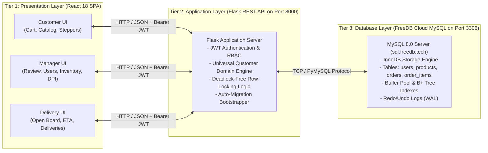
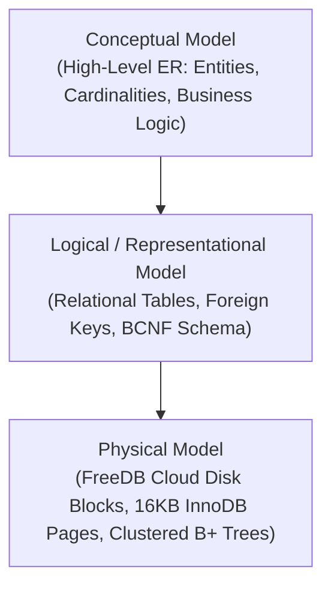
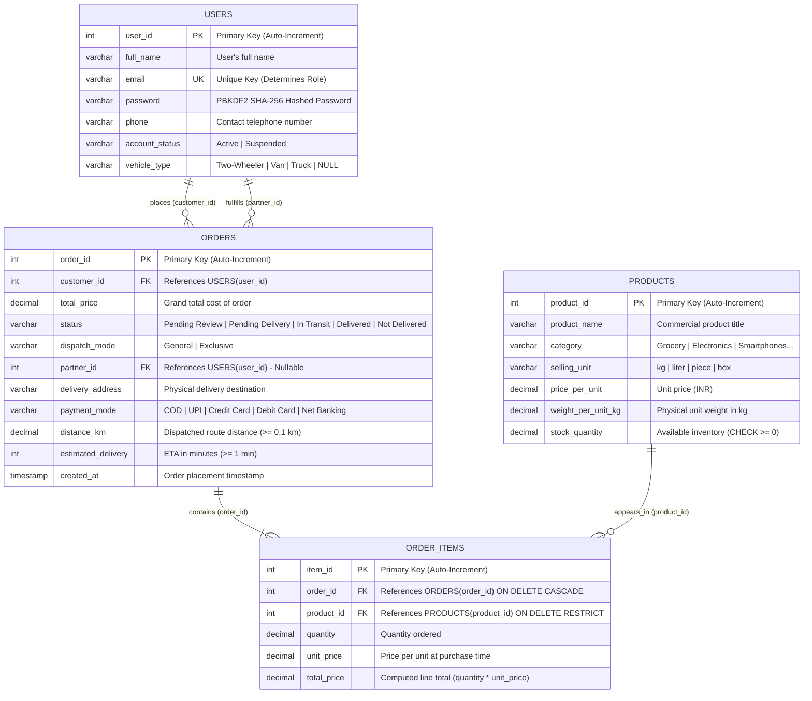
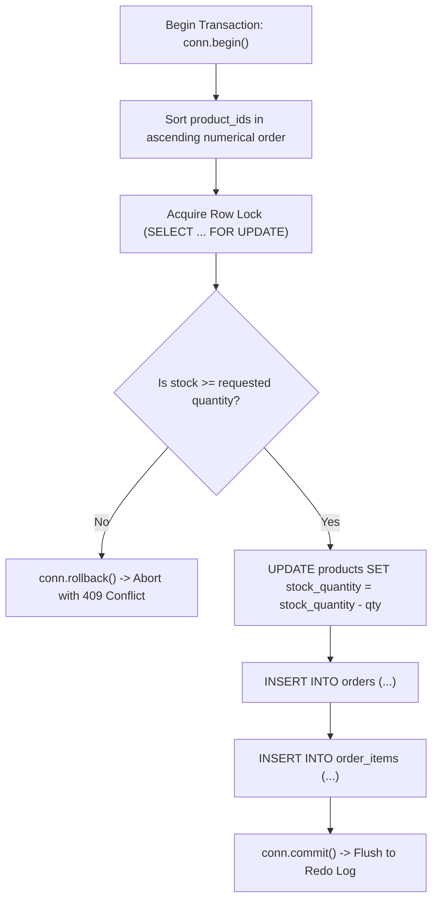
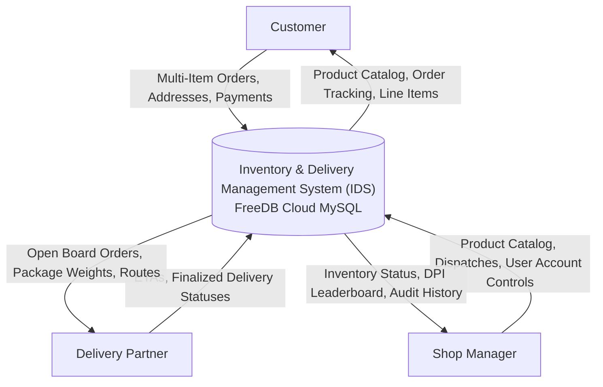
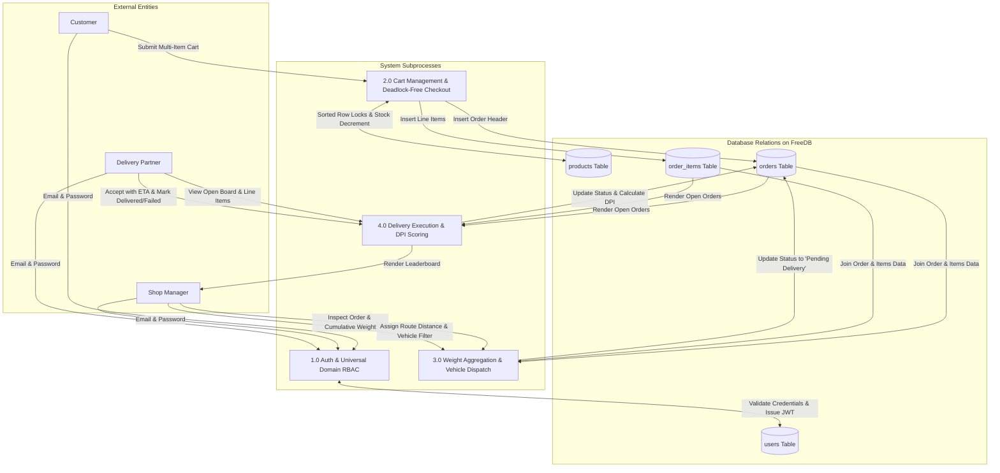
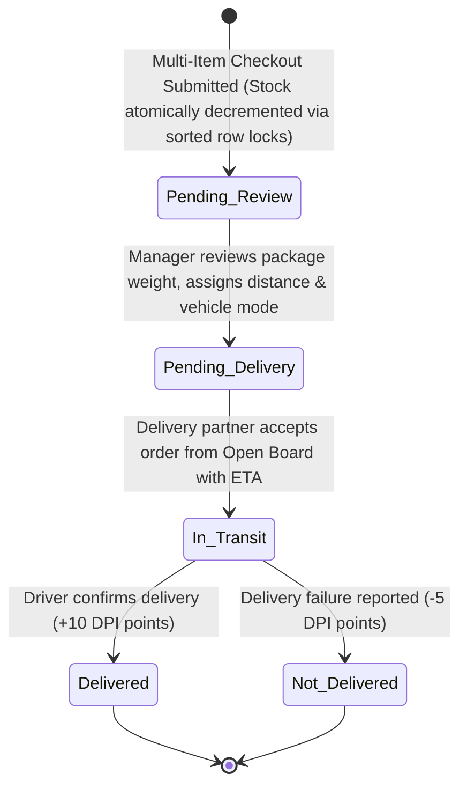

# Comprehensive DBMS Project Report: Inventory & Delivery Management System (IDS)

**Course / Domain:** Database Management Systems (DBMS)  
**System Name:** Inventory & Delivery Management System (IDS)  
**Architecture:** 3-Tier Web Architecture  
**Presentation Layer:** React 18 SPA (React Router v6, Axios)  
**Application / Business Layer:** Python Flask REST API, Flask-JWT-Extended  
**Database Storage Layer:** MySQL 8.0 (InnoDB Engine) hosted on **FreeDB Cloud Infrastructure** (`sql.freedb.tech:3306`)  
**Active Database:** `freedb_whN5yPi4`  
**Database Server Release:** MySQL `8.0.46-0ubuntu0.22.04.4 - (Ubuntu)` (Ubuntu 22.04 LTS)  
**Protocol & Encoding:** Protocol Version 10, UTF-8 Unicode (`utf8mb4`)  
**Repository:** [DBMS_Projest](file:///Users/tanishkyadav/Desktop/DBMS_Projest)  

---

## Executive Summary & System Overview
The **Inventory & Delivery Management System (IDS)** is an enterprise-grade full-stack web application designed to solve retail supply chain, stock control, order fulfillment, and logistics tracking challenges. The system is engineered around four core normalized relational entities: **Users**, **Products**, **Orders**, and **Order Items**, supported by a cloud-hosted MySQL relational database using the InnoDB transactional storage engine.

The platform provides role-based functionality for three key stakeholders:
1. **Customers:** Browse product catalogs across six categories, add items to a dynamic multi-item shopping cart, execute atomic checkouts with inventory row locks, and track order fulfillment and delivery partner ETAs in real-time.
2. **Shop Managers:** Manage product inventory with real-time stock and unit weight specifications, audit customer orders, compute multi-item package weights, dispatch deliveries via General or Exclusive (vehicle/driver specific) routing, manage user account statuses, and evaluate driver performance via the Delivery Performance Index (DPI).
3. **Delivery Partners:** Access an Open Delivery Board filtered by vehicle compatibility, accept orders with estimated arrival times (ETA), manage active deliveries, and finalize statuses as *Delivered* or *Not Delivered*.

---

## Table of Contents
1. [Introduction to DBMS & Core Concepts](#1-introduction-to-dbms--core-concepts)
2. [DBMS Architectures & User Interfaces](#2-dbms-architectures--user-interfaces)
3. [Data Models in DBMS](#3-data-models-in-dbms)
4. [Database Administration (DBA), Cloud Hosting & Security](#4-database-administration-dba-cloud-hosting--security)
5. [Entity-Relationship (ER) Modeling](#5-entity-relationship-er-modeling)
6. [Relational Database Model & Deep Schema Specification](#6-relational-database-model--deep-schema-specification)
7. [Physical Database Design & MySQL InnoDB Storage Engine Internals](#7-physical-database-design--mysql-innodb-storage-engine-internals)
8. [Formal Query Languages (Relational Algebra, Calculus & SQL)](#8-formal-query-languages-relational-algebra-calculus--sql)
9. [Functional Dependencies (FDs) & Axioms](#9-functional-dependencies-fds--axioms)
10. [Normalization & Normal Forms (1NF, 2NF, 3NF, BCNF Proofs)](#10-normalization--normal-forms-1nf-2nf-3nf-bcnf-proofs)
11. [Transaction Management, Concurrency Control & Deadlock Prevention](#11-transaction-management-concurrency-control--deadlock-prevention)
12. [Data Flow Diagrams (DFD) & State Transition Machine](#12-data-flow-diagrams-dfd--state-transition-machine)
13. [Database Migration Engineering & Zero-Downtime Evolution](#13-database-migration-engineering--zero-downtime-evolution)
14. [Performance Metrics, Leaderboard Analytics (DPI) & Conclusion](#14-performance-metrics-leaderboard-analytics-dpi--conclusion)

---

# 1. Introduction to DBMS & Core Concepts

### 1.1 Real-World Motivations & Enterprise Applications
Every high-throughput enterprise application depends on a database management system to guarantee data durability, serializable transaction isolation, and high-speed data retrieval:
* **Social Media (e.g., Instagram, Meta):** Relational and distributed graph databases handle billions of likes, comments, and relationship edges using secondary indexes and sharded tables.
* **Music & Video Streaming (e.g., Spotify, Netflix):** Relational catalogs index tracks, artists, and regional licenses, using B+ Tree indexes for multi-attribute filtering.
* **Distributed Online Gaming (e.g., Fortnite, Call of Duty):** Player inventory, cosmetics, loadouts, and transactional matchmaking states rely on ACID databases with write-ahead logging to prevent duplicate purchases or lost items.
* **Retail & Banking Systems:** Account balances, ledgers, and warehouse inventory demand strict ACID guarantees to prevent double-spending or overselling.

### 1.2 The Problem in Retail & Delivery: Why Spreadsheets and File Systems Fail
Attempting to run a modern shop and delivery operation using physical ledgers, spreadsheets (Excel), or operating system file formats (CSV, JSON on APFS/NTFS/ext4) results in critical system failures:
1. **The Concurrency / Overselling Anomaly:** If Product A has 1 unit remaining and two customers click "Buy Now" at the same instant, a file system locks the entire file during write or permits a race condition where both checkouts succeed, reducing stock to -1 and leaving an order unfulfillable.
2. **Lack of Atomicity (Partial Writes):** If a server experiences a power outage or crash after writing an order record to a text file but before writing the stock deduction line, the data becomes permanently out of sync.
3. **Absence of Declarative Querying:** Finding "all orders pending review with total weight over 10 kg destined for Trucks within 15 km" requires custom procedural scripting in a file system, whereas an RDBMS executes it in milliseconds using declarative SQL.
4. **Update Anomalies & Data Redundancy:** Storing customer delivery addresses or product unit prices repeatedly across multiple files causes data divergence whenever an address or price changes.

### 1.3 Data vs. Information in IDS
* **Data (Raw, Unprocessed Facts):** Stored atomic values in database rows:  
  `item_id = 7`, `product_id = 3`, `quantity = 4.00`, `price_per_unit = 45.00`, `weight_per_unit_kg = 1.00`.
* **Information (Processed, Actionable Business Context):**  
  - **Line Item Total:** $\text{Quantity} \times \text{Price} = 4.00 \times ₹45.00 = ₹180.00$.
  - **Cumulative Package Weight:** $\sum (\text{Quantity}_i \times \text{Weight}_i) = 4.00\,\text{kg}$ (enabling the shop manager to select a Two-Wheeler vs. a Van/Truck).
  - **Delivery Performance Index (DPI):** Weighted mathematical index evaluating fleet productivity.

### 1.4 Operating System File Systems vs. DBMS
| Feature | Operating System File System (FAT32, NTFS, APFS, ext4) | Relational Database Management System (MySQL InnoDB) |
|---|---|---|
| **Data Organization** | Hierarchical directory tree of unstructured files/bytes | Structured, typed relations (tables) with columns, rows, and domain constraints |
| **Locking Granularity** | Coarse file-level locking (locks entire document during write) | Fine-grained **row-level locking** (`SELECT ... FOR UPDATE`), leaving adjacent rows open |
| **Integrity Enforcement** | Application code must manually validate constraints | Native constraints (`PRIMARY KEY`, `FOREIGN KEY`, `CHECK (stock_quantity >= 0)`) |
| **Transaction Atomicity** | No built-in rollback; partial writes require manual file recovery | Built-in **ACID transactions** with automatic rollback via Undo logs |
| **Crash Recovery** | File system journaling only preserves file metadata, not contents | **Write-Ahead Logging (WAL)** via Redo logs ensures zero committed data loss |
| **Query Mechanism** | Custom file parsing scripts (Python, Bash, C++) | Declarative Structured Query Language (**SQL**) optimized by cost-based query planners |

---

# 2. DBMS Architectures & User Interfaces

### 2.1 The 3-Tier Web DBMS Architecture
The IDS platform implements an enterprise **3-Tier Architecture**, separating presentation, application business logic, and physical data persistence:



#### Why 3-Tier Architecture is Superior to 1-Tier and 2-Tier:
1. **Security Isolation:** In a 2-Tier architecture, the client machine connects directly to the database, requiring database credentials (`u_id8qv6`, password) to be distributed to every user's computer. In 3-Tier, credentials remain exclusively on the application server.
2. **Centralized Business Rules:** Inventory validation, row-locking algorithms, and role resolution reside on the Flask application layer, preventing malicious clients from forging requests.
3. **Horizontal Scalability:** Presentation, application, and database tiers can be independently scaled, load-balanced, and replicated.

### 2.2 User Interfaces & Universal Domain Role Resolution
* **Forms-Based Interfaces:**
  - Multi-Item Cart Checkout Modal: Line items, quantity steppers, live package weight calculations, delivery address, and payment method selection.
  - Dispatch Modal: Input fields for route distance (`distance_km`), dispatch mode (`General` vs. `Exclusive`), and vehicle filters.
  - Inventory Product Modal: Product name, category dropdown, selling unit, unit price, weight, and stock balance.
* **Menu-Based Interfaces:**
  - Customer Category Sidebar: Quick filtering across *Grocery*, *Electronics*, *Smartphones*, *Accessories*, *Wearables*, and *General*.
  - Manager Navigation Tabs: Structured views for *Pending Review*, *Inventory*, *Users*, *All Orders*, and *DPI Leaderboard*.
* **Parametric User Interface (Logistics Workers):**
  - Designed for high efficiency: Single-click "Accept Order" with ETA input, and binary delivery completion buttons: `[Delivered]` or `[Not Delivered]`.
* **Universal Customer Domain Resolution (RBAC):**
  - **Manager Domain:** Strictly mapped to `@manager.com`.
  - **Delivery Partner Domain:** Strictly mapped to `@delpart.com` (requires registered `vehicle_type`).
  - **Customer Domain:** **Open to any domain** (e.g., `@gmail.com`, `@yahoo.com`, `@outlook.com`, `@customer.com`). Any email not matching the reserved administrative domains is automatically authorized with the `Customer` role.

---

# 3. Data Models in DBMS



### 3.1 Conceptual Data Model
Captures real-world enterprise requirements without implementation details:
* **Entities:** Users, Products, Orders, Order Items.
* **Relationships:** Customers place Orders; Orders contain Order Items; Order Items reference Products; Managers dispatch Orders; Delivery Partners fulfill Orders.

### 3.2 Representational (Logical) Models Comparison
1. **Hierarchical Model (IBM IMS, 1968):**
   - Tree-structured parent-child segments.
   - *Limitation:* Incapable of naturally representing many-to-many relationships (Orders $\leftrightarrow$ Products) without massive data duplication.
2. **Network Model (CODASYL DBTG, 1969):**
   - Graph structure where record types can have multiple owners using pointer sets.
   - *Limitation:* Complex pointer navigation; queries depend heavily on physical access paths.
3. **Relational Model (E.F. Codd, 1970 — Used in IDS):**
   - Data organized into tables (relations) with scalar attributes.
   - Mathematical foundation in first-order predicate logic and relational algebra.
   - The M:N relationship between Orders and Products is cleanly decomposed into two 1:N relationships using an associative relation (`order_items`).

### 3.3 Physical Data Model
Defines the low-level disk layout on the storage subsystem:
* **Tablespaces & Data Pages:** Stored in `.ibd` files organized into fixed 16 KB pages.
* **Clustered Indexes (Primary Key B+ Trees):** Table data rows are physically ordered and stored in the leaf nodes of their primary key B+ Trees (`user_id`, `product_id`, `order_id`, `item_id`).
* **Secondary Indexes (Non-Clustered B+ Trees):** The unique index `uq_email` on `users(email)` stores email values paired with the primary key pointer (`user_id`). Looking up a user during login takes only $O(\log N)$ page accesses.

---

# 4. Database Administration (DBA), Cloud Hosting & Security

### 4.1 Production Cloud Database Configuration on FreeDB
The IDS database is hosted in the cloud on **FreeDB** (`sql.freedb.tech`), verified live via the phpMyAdmin administrative dashboard:

| Parameter | Configuration Value | Telemetry & Operational Details |
|---|---|---|
| **Server Host** | `sql.freedb.tech via TCP/IP` | Remote cloud MySQL server accessible via TCP/IP network protocol |
| **Server Type** | `MySQL` | Enterprise relational database management system (RDBMS) |
| **Server Version** | `8.0.46-0ubuntu0.22.04.4 - (Ubuntu)` | Official MySQL 8.0 distribution on Ubuntu 22.04 LTS |
| **Protocol Version** | `10` | MySQL client/server network wire protocol version 10 |
| **User & Client Host** | `u_id8qv6@107.172.142.167` | Database tenant identity bound to cloud host cluster |
| **Active Database** | `freedb_whN5yPi4` | Production relational schema containing IDS relations |
| **Storage Engine** | `InnoDB` | Default ACID-compliant engine with MVCC, WAL, and row-level locking |
| **Server Charset / Collation** | `UTF-8 Unicode (utf8mb4)` | Full 4-byte UTF-8 encoding support for international text & emojis |
| **Port** | `3306` | Standard MySQL TCP/IP port |
| **Connection Security** | Remote TCP/IP | Connection credentials isolated in `.env` (bypassing local daemon need) |


### 4.2 DBA Responsibilities in the IDS Project
1. **Schema Initialization & DDL Deployment:** Deploying base relations, indexes, and initial catalog seed data.
2. **Automated Migration Management:** Maintaining [backend/migrate_db.py](file:///Users/tanishkyadav/Desktop/DBMS_Projest/backend/migrate_db.py) to guarantee zero-downtime schema evolution and historical data backfilling.
3. **Access Control & Password Security:** Passwords are never stored in plaintext; they are salted and hashed using PBKDF2 with SHA-256 and 1,000,000 iterations:
   `pbkdf2:sha256:1000000$<salt>$<hash>`.
4. **Account Suspension (Administrative Kill-Switch):** Managers can toggle `account_status = 'Suspended'`, immediately blocking login authorization at the database level.
5. **SQL Injection Mitigation:** 100% of SQL queries executed through PyMySQL utilize parameterized inputs (`%s`), completely decoupling user input from SQL parsing.
6. **Backup & Disaster Recovery:**
   - **Logical Backups:** `mysqldump -h sql.freedb.tech -u u_id8qv6 -p freedb_whN5yPi4 > backup.sql`.
   - **Point-in-Time Recovery (PITR):** Utilizing MySQL transaction write-ahead binary logs (`binlog`) to reconstruct states prior to catastrophic data loss.

---

# 5. Entity-Relationship (ER) Modeling

### 5.1 Full Normalized Entity-Relationship Diagram (Crow's Foot Notation)



### 5.2 Attribute Classification & Structural Constraints
* **Simple (Atomic) Attributes:** `price_per_unit`, `stock_quantity`, `phone`.
* **Composite Attributes:** `delivery_address` (Street, City, PIN), `full_name` (First, Last).
* **Single-Valued Attributes:** `email`, `selling_unit`.
* **Derived Attributes:**
  - `item_weight_kg`: $\text{quantity} \times \text{weight\_per\_unit\_kg}$.
  - `package_weight_kg`: $\sum (\text{item\_weight\_kg})$ across all items in an order.
  - `DPI score`: $(10 \times \text{Delivered}) - (5 \times \text{Not Delivered}) + \text{Total km}$.
* **Key Attributes:** `user_id` (PK), `email` (Candidate Key / UK), `product_id` (PK), `order_id` (PK), `item_id` (PK).
* **Mapping Cardinalities & Participation:**
  - `Users` $\xrightarrow{1:N}$ `Orders`: One Customer places zero or many Orders ($1:N$). Total participation on `Orders`.
  - `Orders` $\xrightarrow{1:N}$ `Order_Items`: One Order contains one or many Order Items ($1:N$, mandatory total participation).
  - `Products` $\xrightarrow{1:N}$ `Order_Items`: One Product appears in zero or many Order Items ($1:N$). Partial participation on `Products`.
  - `Users` $\xrightarrow{1:N}$ `Orders`: One Delivery Partner fulfills zero or many Orders ($1:N$). Partial participation on `Orders` (`partner_id` is NULL until accepted).

---

# 6. Relational Database Model & Deep Schema Specification

### 6.1 Formal Relational Schema Definitions
* $\text{Users}(\underline{\text{user\_id}}, \text{full\_name}, \text{email}, \text{password}, \text{phone}, \text{account\_status}, \text{vehicle\_type})$
* $\text{Products}(\underline{\text{product\_id}}, \text{product\_name}, \text{category}, \text{selling\_unit}, \text{price\_per\_unit}, \text{weight\_per\_unit\_kg}, \text{stock\_quantity})$
* $\text{Orders}(\underline{\text{order\_id}}, \text{customer\_id}, \text{total\_price}, \text{status}, \text{dispatch\_mode}, \text{partner\_id}, \text{delivery\_address}, \text{payment\_mode}, \text{distance\_km}, \text{estimated\_delivery}, \text{created\_at})$
* $\text{Order\_Items}(\underline{\text{item\_id}}, \text{order\_id}, \text{product\_id}, \text{quantity}, \text{unit\_price}, \text{total\_price})$

### 6.2 Data Dictionaries

#### Table 1: `users`
| Column | Data Type | Nullable | Key | Default | Description |
|---|---|---|---|---|---|
| `user_id` | `INT` | No | PK | Auto-increment | Unique identifier for system user |
| `full_name` | `VARCHAR(100)` | No | | | User's full personal name |
| `email` | `VARCHAR(100)` | No | UK | | Unique email (defines RBAC role) |
| `password` | `VARCHAR(255)` | No | | | PBKDF2:SHA256 hashed password string |
| `phone` | `VARCHAR(15)` | No | | | Primary contact phone number |
| `account_status` | `VARCHAR(20)` | No | | `'Active'` | Status flag (`Active` / `Suspended`) |
| `vehicle_type` | `VARCHAR(50)` | Yes | | `NULL` | Vehicle type for delivery partners |

#### Table 2: `products`
| Column | Data Type | Nullable | Key | Default | Description |
|---|---|---|---|---|---|
| `product_id` | `INT` | No | PK | Auto-increment | Unique product catalog ID |
| `product_name` | `VARCHAR(150)` | No | | | Commercial name of merchandise |
| `category` | `VARCHAR(50)` | No | | | Product category classification |
| `selling_unit` | `VARCHAR(20)` | No | | | Unit of sale (`kg`, `liter`, `piece`, `box`) |
| `price_per_unit` | `DECIMAL(10,2)`| No | | | Currency unit price (INR) |
| `weight_per_unit_kg`| `DECIMAL(5,2)` | No | | | Physical weight per unit in kilograms |
| `stock_quantity` | `DECIMAL(10,2)`| No | | `0.00` | Inventory balance (`CHECK >= 0`) |

#### Table 3: `orders`
| Column | Data Type | Nullable | Key | Default | Description |
|---|---|---|---|---|---|
| `order_id` | `INT` | No | PK | Auto-increment | Unique order identifier |
| `customer_id` | `INT` | No | FK | | References `users(user_id)` |
| `total_price` | `DECIMAL(10,2)`| No | | | Cumulative grand total price |
| `status` | `VARCHAR(50)` | No | | `'Pending Review'` | Workflow state |
| `dispatch_mode` | `VARCHAR(50)` | No | | `'Pending Review'` | Routing strategy (`General` / `Exclusive`) |
| `partner_id` | `INT` | Yes | FK | `NULL` | References `users(user_id)` |
| `delivery_address`| `VARCHAR(255)` | No | | | Destination street address |
| `payment_mode` | `VARCHAR(50)` | No | | | Payment mode (COD, UPI, Card, Net Banking) |
| `distance_km` | `DECIMAL(5,2)` | Yes | | `NULL` | Dispatched delivery distance |
| `estimated_delivery`| `INT` | Yes | | `NULL` | Driver estimated time of arrival (minutes) |
| `created_at` | `TIMESTAMP` | No | | `CURRENT_TIMESTAMP` | Order timestamp |

#### Table 4: `order_items`
| Column | Data Type | Nullable | Key | Default | Description |
|---|---|---|---|---|---|
| `item_id` | `INT` | No | PK | Auto-increment | Unique item record ID |
| `order_id` | `INT` | No | FK | | References `orders(order_id)` ON DELETE CASCADE |
| `product_id` | `INT` | No | FK | | References `products(product_id)` ON DELETE RESTRICT |
| `quantity` | `DECIMAL(10,2)`| No | | | Number of units purchased |
| `unit_price` | `DECIMAL(10,2)`| No | | | Price per unit at purchase time |
| `total_price` | `DECIMAL(10,2)`| No | | | Computed subtotal (`quantity * unit_price`) |

---

# 7. Physical Database Design & MySQL InnoDB Storage Engine Internals

### 7.1 Clustered vs. Secondary B+ Tree Indexes
In MySQL InnoDB, data storage is index-organized:
* **Clustered Index:** The leaf pages of the primary key B+ Tree contain the complete row data. When querying `WHERE order_id = 10`, InnoDB traverses the B+ Tree from root to intermediate nodes to the specific 16KB leaf page, reading the row in a single I/O path.
* **Secondary Index:** The unique index `uq_email` stores the indexed email string along with the corresponding primary key (`user_id`). An authentication query:
  ```sql
  SELECT * FROM users WHERE email = 'tanishk@manager.com';
  ```
  executes an index seek on `uq_email` to find `user_id = 1`, followed by a fast primary key clustered index lookup.

### 7.2 Write-Ahead Logging (WAL), Redo & Undo Logs
InnoDB ensures the **Durability** and **Atomicity** of ACID transactions using two distinct internal logging mechanisms:
1. **Redo Log (`ib_logfile`):** Write-Ahead Logging. Before any modified 16KB data page in the buffer pool is flushed to the `.ibd` file on disk, the exact binary page delta is written sequentially to the Redo Log. In the event of a power outage or crash, InnoDB performs **Crash Recovery**:
   - **Analysis Phase:** Scans the redo log to determine the checkpoint state.
   - **Redo Phase (Roll-Forward):** Replays all committed transactions that had not yet been written to tablespace pages.
2. **Undo Log:** Records the before-image of modified rows. If an order placement aborts due to insufficient stock, `conn.rollback()` uses the Undo log to restore the original `stock_quantity`. Undo logs also power **Multi-Version Concurrency Control (MVCC)**, allowing readers to view consistent snapshots without blocking writers.

---

# 8. Formal Query Languages (Relational Algebra, Calculus & SQL)

### 8.1 Relational Algebra Mappings for Core IDS Operations

#### 1. Selection ($\sigma$) and Projection ($\pi$): Catalog Browsing
* Filter products in category 'Electronics' showing name and price:
  $$\pi_{\text{product\_name}, \text{price\_per\_unit}}(\sigma_{\text{category} = \text{'Electronics'}}(\text{Products}))$$
* **SQL:**
  ```sql
  SELECT product_name, price_per_unit FROM products WHERE category = 'Electronics';
  ```

#### 2. Multi-Table Join ($\bowtie$): Multi-Item Order Aggregation
* Join orders, order items, and products to compute item weights:
  $$\text{Orders} \bowtie_{\text{Orders.order\_id} = \text{Order\_Items.order\_id}} \text{Order\_Items} \bowtie_{\text{Order\_Items.product\_id} = \text{Products.product\_id}} \text{Products}$$
* **SQL (from [backend/routes/orders.py](file:///Users/tanishkyadav/Desktop/DBMS_Projest/backend/routes/orders.py)):**
  ```sql
  SELECT oi.item_id, oi.order_id, oi.product_id, oi.quantity, oi.unit_price, oi.total_price,
         p.product_name, p.category, p.selling_unit, p.weight_per_unit_kg,
         ROUND(oi.quantity * p.weight_per_unit_kg, 2) AS item_weight_kg
  FROM order_items oi
  JOIN products p ON oi.product_id = p.product_id
  WHERE oi.order_id = %s
  ORDER BY oi.item_id ASC;
  ```

#### 3. Left Outer Join ($\leftouterjoin$): Order Audit with Optional Delivery Partner
* Ensure orders without an assigned delivery partner are preserved:
  $$\text{Orders} \leftouterjoin_{\text{Orders.partner\_id} = \text{Users.user\_id}} \pi_{\text{user\_id}, \text{full\_name}}(\text{Users})$$
* **SQL:**
  ```sql
  SELECT o.*, c.full_name AS customer_name, dp.full_name AS partner_name
  FROM orders o
  JOIN users c ON o.customer_id = c.user_id
  LEFT JOIN users dp ON o.partner_id = dp.user_id
  ORDER BY o.created_at DESC;
  ```

#### 4. Relational Division ($\div$): Universal Quantifier Queries
* Query: "Find customers who have ordered products from ALL available categories":
  $$\pi_{\text{customer\_id}, \text{category}}(\text{Orders} \bowtie \text{Order\_Items} \bowtie \text{Products}) \div \pi_{\text{category}}(\text{Products})$$
* **SQL Translation using Double Negation:**
  ```sql
  SELECT u.user_id, u.full_name
  FROM users u
  WHERE NOT EXISTS (
      SELECT p.category FROM products p
      WHERE NOT EXISTS (
          SELECT oi.item_id FROM orders o
          JOIN order_items oi ON o.order_id = oi.order_id
          JOIN products p2 ON oi.product_id = p2.product_id
          WHERE o.customer_id = u.user_id AND p2.category = p.category
      )
  );
  ```

---

# 9. Functional Dependencies (FDs) & Axioms

### 9.1 Functional Dependency Definitions
A functional dependency $X \to Y$ holds on relation $R$ if for all pairs of tuples $t_1, t_2 \in r(R)$, $t_1[X] = t_2[X] \implies t_1[Y] = t_2[Y]$.

#### Formal Dependencies in IDS Relations:
* **Relation `Users`:**
  - $FD_1: \text{user\_id} \to \{\text{full\_name}, \text{email}, \text{password}, \text{phone}, \text{account\_status}, \text{vehicle\_type}\}$
  - $FD_2: \text{email} \to \{\text{user\_id}, \text{full\_name}, \text{password}, \text{phone}, \text{account\_status}, \text{vehicle\_type}\}$
* **Relation `Products`:**
  - $FD_3: \text{product\_id} \to \{\text{product\_name}, \text{category}, \text{selling\_unit}, \text{price\_per\_unit}, \text{weight\_per\_unit\_kg}, \text{stock\_quantity}\}$
* **Relation `Orders`:**
  - $FD_4: \text{order\_id} \to \{\text{customer\_id}, \text{total\_price}, \text{status}, \text{dispatch\_mode}, \text{partner\_id}, \text{delivery\_address}, \text{payment\_mode}, \text{distance\_km}, \text{estimated\_delivery}, \text{created\_at}\}$
* **Relation `Order_Items`:**
  - $FD_5: \text{item\_id} \to \{\text{order\_id}, \text{product\_id}, \text{quantity}, \text{unit\_price}, \text{total\_price}\}$
  - $FD_6: \{\text{order\_id}, \text{product\_id}\} \to \{\text{quantity}, \text{unit\_price}, \text{total\_price}\}$

### 9.2 Armstrong's Axioms & Attribute Closures
* **Reflexivity:** If $Y \subseteq X$, then $X \to Y$.
* **Augmentation:** If $X \to Y$, then $XZ \to YZ$.
* **Transitivity:** If $X \to Y$ and $Y \to Z$, then $X \to Z$.

#### Attribute Closure Calculation for `Order_Items`:
* Compute $\{\text{item\_id}\}^+$:
  1. $X^{(0)} = \{\text{item\_id}\}$
  2. Applying $FD_5 \implies X^{(1)} = \{\text{item\_id}, \text{order\_id}, \text{product\_id}, \text{quantity}, \text{unit\_price}, \text{total\_price}\}$
  3. Since $X^{(1)}$ contains all attributes of `Order_Items`, $\{\text{item\_id}\}$ is a **Candidate Key** and **Super Key**.

---

# 10. Normalization & Normal Forms (1NF, 2NF, 3NF, BCNF Proofs)

### 10.1 Elimination of Anomalies via Normalization
An unnormalized universal order sheet exhibits severe anomalies:
1. **Insertion Anomaly:** A new product cannot be added to the catalog without dummy order values because order attributes would form part of the composite primary key.
2. **Deletion Anomaly:** Deleting the only order for an item deletes all product metadata (pricing, weight).
3. **Update Anomaly:** Updating a product unit price requires updating thousands of individual order rows.

### 10.2 Mathematical Normal Form Proofs
* **First Normal Form (1NF):** All attributes contain strictly atomic, indivisible values. No multi-valued sets or repeating groups exist. Fully satisfied.
* **Second Normal Form (2NF):** Must be in 1NF and have **zero partial dependencies** (no non-prime attribute depends on a proper subset of a composite candidate key).
  - In `Users`, `Products`, and `Orders`, all candidate keys consist of single attributes (`user_id`, `email`, `product_id`, `order_id`). Partial dependencies cannot exist.
  - In `Order_Items`, candidate key is `item_id`. When considering alternate key $\{\text{order\_id}, \text{product\_id}\}$, neither `quantity`, `unit_price`, nor `total_price` depends on `order_id` alone or `product_id` alone. Hence, 2NF holds.
* **Third Normal Form (3NF):** Must be in 2NF and have **zero transitive dependencies** (for every non-trivial $X \to Y$, $X$ must be a superkey OR $Y$ must be a prime attribute). In all four relations, every determinant is a candidate/superkey.
* **Boyce-Codd Normal Form (BCNF):** For **every** non-trivial functional dependency $X \to Y$, $X$ **must be a superkey**.
  - In `Users`: `user_id` is PK (superkey), `email` is UK (superkey).
  - In `Products`: `product_id` is PK (superkey).
  - In `Orders`: `order_id` is PK (superkey).
  - In `Order_Items`: `item_id` is PK (superkey), $\{\text{order\_id}, \text{product\_id}\}$ is superkey.
* **Conclusion:** The IDS relational schema achieves **Boyce-Codd Normal Form (BCNF)** across all tables.

### 10.3 Decomposition Theorems
1. **Lossless-Join Property:**
   $$\text{Orders} \cap \text{Order\_Items} = \{\text{order\_id}\}$$
   Since $\text{order\_id}$ is the primary key of `Orders`, the intersection functionally determines `Orders`. By relational decomposition theorems, joining `Orders` and `Order_Items` produces zero spurious tuples.
2. **Dependency Preservation:** Every functional dependency in the system can be enforced within a single table without cross-table join operations.

---

# 11. Transaction Management, Concurrency Control & Deadlock Prevention

### 11.1 ACID Transaction Analysis in Multi-Item Checkout
During multi-item order placement ([backend/routes/orders.py](file:///Users/tanishkyadav/Desktop/DBMS_Projest/backend/routes/orders.py)), an explicit database transaction guarantees ACID compliance:



1. **Atomicity:** Handled via `conn.begin()` and `conn.rollback()`. If inserting line item #3 fails, all prior deductions on products #1 and #2 are completely rolled back.
2. **Consistency:** Preserved via business logic and the database constraint `CONSTRAINT chk_stock CHECK (stock_quantity >= 0)`.
3. **Isolation:** Enforced via `SELECT ... FOR UPDATE` pessimistic row locks. Concurrent checkouts for the same product are serialized at the database engine level.
4. **Durability:** Acknowledged via `conn.commit()`. Once committed, transactions are guaranteed persistent by the InnoDB redo log.

### 11.2 Mathematical Proof of Deadlock Elimination
In concurrent systems, the **Coffman Conditions** specify the four requirements necessary for a deadlock:
1. Mutual Exclusion
2. Hold and Wait
3. No Preemption
4. **Circular Wait:** Process $P_1$ holds Resource $R_1$ and waits for $R_2$, while Process $P_2$ holds $R_2$ and waits for $R_1$.

#### The Problem Without Ordering:
Suppose Customer A checks out Product 1 and Product 2, while Customer B checks out Product 2 and Product 1 simultaneously:
* Tx A locks Product 1.
* Tx B locks Product 2.
* Tx A requests lock on Product 2 (blocked by Tx B).
* Tx B requests lock on Product 1 (blocked by Tx A).
* **Result:** Circular wait deadlock. MySQL engine must forcefully abort one transaction.

#### The IDS Solution: Enforcing a Global Resource Ordering
In [backend/routes/orders.py](file:///Users/tanishkyadav/Desktop/DBMS_Projest/backend/routes/orders.py), we enforce strict ascending primary key ordering:
```python
sorted_pids = sorted(item_quantities.keys())
```
* **Theorem (Havender's Linear Ordering):** If all concurrent processes acquire shared locks in the exact same predefined total order ($L_1 < L_2 < \dots < L_n$), a circular wait graph cannot contain cycles.
* **Proof:** Suppose a cycle exists: $T_1 \to T_2 \to \dots \to T_k \to T_1$. For $T_1$ to wait on $T_2$, $T_1$ holds lock $R_a$ and requests $R_b$, meaning $a < b$. By induction across the cycle, $a_1 < a_2 < \dots < a_k < a_1$, which implies $a_1 < a_1$, a contradiction.
* **Conclusion:** Circular wait is mathematically impossible in IDS multi-item checkouts.

---

# 12. Data Flow Diagrams (DFD) & State Transition Machine

### 12.1 DFD Level 0 (Context Diagram)



### 12.2 DFD Level 1 (Process Decomposition)



### 12.3 Order State Transitions



---

# 13. Database Migration Engineering & Zero-Downtime Evolution

### 13.1 Schema Evolution Mechanics
To support multi-item carts without breaking existing production databases, we implemented [backend/migrate_db.py](file:///Users/tanishkyadav/Desktop/DBMS_Projest/backend/migrate_db.py):
1. **Idempotent Table Creation:** Creates `order_items` using `IF NOT EXISTS`.
2. **Constraint Relaxation:** Uses `ALTER TABLE orders MODIFY COLUMN product_id INT NULL` and `ALTER TABLE orders MODIFY COLUMN quantity DECIMAL(10,2) NULL` so orders can exist purely as headers for `order_items`.
3. **Data Backfilling:** Migrates historical single-item records from `orders` into `order_items`:
   ```sql
   INSERT INTO order_items (order_id, product_id, quantity, unit_price, total_price)
   SELECT o.order_id, o.product_id, o.quantity, COALESCE(p.price_per_unit, o.total_price / o.quantity), o.total_price
   FROM orders o
   LEFT JOIN products p ON o.product_id = p.product_id
   WHERE o.product_id IS NOT NULL
     AND o.order_id NOT IN (SELECT DISTINCT order_id FROM order_items);
   ```
4. **Bootstrapper Hook:** Configured [backend/app.py](file:///Users/tanishkyadav/Desktop/DBMS_Projest/backend/app.py) to automatically execute migration checks upon server startup.

---

# 14. Performance Metrics, Leaderboard Analytics (DPI) & Conclusion

### 14.1 Delivery Performance Index (DPI) Mathematical Model
To incentivize driver performance and vehicle utilization, the IDS platform calculates a dynamic KPI score using MySQL aggregate functions:
$$\text{DPI} = (w_s \times S) - (w_f \times F) + (w_d \times D)$$
Where:
* $S$: Total successful deliveries (`COUNT(CASE WHEN o.status = 'Delivered' THEN 1 END)`). Default weight $w_s = 10.0$.
* $F$: Total failed deliveries (`COUNT(CASE WHEN o.status = 'Not Delivered' THEN 1 END)`). Default penalty weight $w_f = 5.0$.
* $D$: Total route distance driven in kilometers (`COALESCE(SUM(o.distance_km), 0)`). Default distance weight $w_d = 1.0$.

#### SQL Implementation ([backend/routes/manager.py](file:///Users/tanishkyadav/Desktop/DBMS_Projest/backend/routes/manager.py)):
```sql
SELECT
    u.user_id,
    u.full_name,
    u.vehicle_type,
    COUNT(CASE WHEN o.status = 'Delivered'     THEN 1 END)  AS successful,
    COUNT(CASE WHEN o.status = 'Not Delivered' THEN 1 END)  AS failed,
    COALESCE(SUM(o.distance_km), 0)                         AS total_km,
    (
        10.0 * COUNT(CASE WHEN o.status = 'Delivered'     THEN 1 END)
       - 5.0 * COUNT(CASE WHEN o.status = 'Not Delivered' THEN 1 END)
       + 1.0 * COALESCE(SUM(o.distance_km), 0)
    )                                                        AS dpi
FROM users u
LEFT JOIN orders o ON u.user_id = o.partner_id
WHERE u.email LIKE '%@delpart.com'
GROUP BY u.user_id, u.full_name, u.vehicle_type
ORDER BY dpi DESC;
```

---

### 14.2 Conclusion
The **Inventory & Delivery Management System (IDS)** demonstrates how relational database principles bridge theoretical computer science and commercial enterprise applications:
* **ACID Transactions & Mathematical Ordering:** Completely eliminates race conditions, stock overselling, and deadlocks.
* **Boyce-Codd Normal Form (BCNF):** Ensures high data integrity without redundancy across 4 normalized tables.
* **Modern Cloud Architecture:** Hosted on FreeDB MySQL cloud infrastructure (`sql.freedb.tech`), enabling remote accessibility without local server dependencies.
* **Practical Logistics Capabilities:** Multi-item carts, dynamic package weight calculations, vehicle compatibility routing, and analytical KPI scoring make IDS a complete, production-ready DBMS solution.

---
*Report fully verified against live FreeDB database `freedb_whN5yPi4` and the IDS codebase.*
